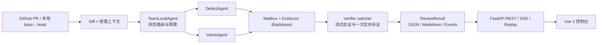

# ReviewCrew：流式多 Agent 智能代码审查

ReviewCrew 面向 GitHub Pull Request 或本地 Git `base/head` 差异进行证据驱动审查。系统由 Team Lead 规划风险与预算，DefectAgent 和 IntentAgent 并行产生候选，VerifierAgent 在候选到达时立即反证，最终输出结构化 JSON、中文 Markdown 报告和可供 Vue 前端消费的事件流。

当前仓库已经具备离线 Fake 测试、FastAPI REST/SSE/Replay、Vue 3 控制台和 Greptile Benchmark Fake 流程。真实模型审查需要自行提供有效模型密钥；真实 Benchmark CLI 尚未接入执行器，五个公开案例仍为 `needs_review`，因此本项目不宣称已有真实 PR 命中率。真实状态见[评测报告](docs/评测报告.md)。

## 架构亮点



- **流式 Agent Team**：两个专家通过 `asyncio.TaskGroup` 并行工作；候选一产生便发布，Verifier 不等待专家全部结束。
- **Verifier watcher**：独立验证候选是否由当前 PR 引入、是否可达、是否有上游保护、定位与严重度是否可信；证据不足时最多发起一次定向补证。
- **Evidence Blackboard**：只保存结构化消息、证据和裁决，不保存隐藏思维链。Mailbox 同时写入脱敏后的 `runs/{run_id}/mailbox.jsonl`，便于审计。
- **版本化 Skills 与 Hooks**：审查方法以带 YAML 元数据的 Markdown Skill 保存，记录名称、版本、角色、风险、耗时预算和内容哈希；Agent 生命周期 Hook 支持观测与安全拒绝，普通 Hook 失败不会阻断主流程。
- **传统工具融合**：从 Git diff 出发，按需读取修改行附近代码、关联测试和项目文档，并把可选 Semgrep 信号加入 ContextPack。文件读取受仓库边界与行数限制约束。
- **确定性编排**：上下文构建、消息路由、去重、预算、持久化和报告由普通代码完成，模型只负责规划、发现和验证。

## 运行要求

- Conda
- Python 3.12（`pyproject.toml` 要求 Python `>=3.12`）
- Git
- Node.js 20+ 与 pnpm 11（前端）
- 可选：Semgrep；缺失时静态信号阶段自动降级为空，不阻断审查

以下命令均以 Windows PowerShell、仓库根目录为起点。

## 安装

### 1. 创建 Python 3.12 环境

```powershell
conda create -n reviewcrew python=3.12 -y
conda activate reviewcrew
python -m pip install --upgrade pip
python -m pip install -e ".[agent,dev]"
```

`agent` 安装真实模型运行所需的 Pydantic AI，`dev` 安装测试依赖。

### 2. 安装前端依赖

```powershell
Set-Location .\frontend
pnpm install --frozen-lockfile
Set-Location ..
```

如果未安装 pnpm，可先执行：

```powershell
npm install --global pnpm@11.9.0
```

## 配置

复制模板并仅在本机填写密钥：

```powershell
Copy-Item .env.example .env
```

`.env` 已被 Git 忽略。当前真实 smoke 已验证 `deepseek-v4-pro` 的 OpenAI 兼容接口；Base URL 必须保留 `/v1`，缺少该路径时会产生 `UnexpectedModelBehavior`。也可改为其他已验证的 OpenAI 兼容服务。

```dotenv
REVIEWCREW_LLM_PROVIDER=openai-compatible
REVIEWCREW_LLM_BASE_URL=https://api.ai-native-x.site/v1
REVIEWCREW_LLM_API_KEY=请填写真实密钥
REVIEWCREW_LLM_MODEL=deepseek-v4-pro
REVIEWCREW_LLM_TEMPERATURE=0.2
REVIEWCREW_LLM_TIMEOUT_SECONDS=120
REVIEWCREW_LLM_MAX_RETRIES=2

# 角色模型留空时回退到 REVIEWCREW_LLM_MODEL
REVIEWCREW_TEAM_LEAD_MODEL=
REVIEWCREW_DEFECT_MODEL=
REVIEWCREW_INTENT_MODEL=
REVIEWCREW_VERIFIER_MODEL=

# 全局 10 分钟硬预算与阶段预算
REVIEWCREW_GLOBAL_TIMEOUT_SECONDS=600
REVIEWCREW_PR_LOAD_TIMEOUT_SECONDS=30
REVIEWCREW_CONTEXT_TIMEOUT_SECONDS=90
REVIEWCREW_REVIEW_TIMEOUT_SECONDS=300
REVIEWCREW_VERIFIER_TIMEOUT_SECONDS=120
REVIEWCREW_REPORT_TIMEOUT_SECONDS=30
REVIEWCREW_MAX_CONCURRENCY=4
REVIEWCREW_CONTEXT_CHARACTER_BUDGET=120000

REVIEWCREW_RUNS_DIR=runs
REVIEWCREW_GITHUB_TOKEN=
```

变量说明：

| 变量 | 用途 |
|---|---|
| `REVIEWCREW_LLM_*` | 全局 Provider、地址、密钥、默认模型、温度、单次超时和重试次数 |
| `REVIEWCREW_TEAM_LEAD_MODEL` | Team Lead 专用模型；留空回退到全局模型 |
| `REVIEWCREW_DEFECT_MODEL` | 静态缺陷、安全、资源与并发专家模型 |
| `REVIEWCREW_INTENT_MODEL` | 业务逻辑、状态、契约与架构专家模型 |
| `REVIEWCREW_VERIFIER_MODEL` | 独立反证与最终裁决模型 |
| `REVIEWCREW_*_TIMEOUT_SECONDS` | 全局与各阶段时间上限；阶段并行执行，总流程仍受 600 秒 watchdog 限制 |
| `REVIEWCREW_CONTEXT_CHARACTER_BUDGET` | 每个 ContextPack 的字符预算 |
| `REVIEWCREW_GITHUB_TOKEN` | 可选，只读 GitHub Token；公开 PR 可匿名读取但容易受限流影响 |

仓库保留的结构化连通性检查入口名为 GLM smoke，但它使用 OpenAI 兼容协议，并读取一组独立的 `GLM_*` 环境变量。已验证的当前模型配置如下；命令不会读取或打印密钥：

```powershell
$env:GLM_API_KEY = "请填写真实密钥"
$env:GLM_MODEL = "deepseek-v4-pro"
$env:GLM_BASE_URL = "https://api.ai-native-x.site/v1"
$env:GLM_TEMPERATURE = "0.0"
$env:GLM_TIMEOUT_SECONDS = "120"
$env:GLM_MAX_RETRIES = "2"
python -m reviewcrew.llm.glm --smoke
```

未设置 `GLM_API_KEY` 时命令会明确返回失败，不会伪造连通成功。当前成功仅证明模型能返回预期的结构化 smoke 对象，不等于完成了真实 PR 审查或取得 Benchmark 命中。

## 审查方式

### 离线 Fake 全链路

公开 CLI 没有虚构的 `--fake` 参数。确定性 Fake 通过自动测试注入模型角色，覆盖临时 Git 仓库、Orchestrator、FastAPI、SSE、报告、Replay 协议和前端 Store：

```powershell
pytest tests/test_full_stack.py -v
```

无需模型密钥或网络的可视化演示：

```powershell
Set-Location .\frontend
pnpm dev
```

打开 `http://127.0.0.1:5173`，点击“播放最佳离线回放”。该演示读取 `frontend/src/fixtures/demo-events.jsonl`，不代表真实模型结果。

### 真实 GitHub PR 审查

```powershell
python -m reviewcrew.cli review --pr https://github.com/OWNER/REPOSITORY/pull/123
```

### 真实本地提交审查

```powershell
python -m reviewcrew.cli review `
  --repo D:\workspace\your-repository `
  --base main `
  --head feature/my-change
```

真实审查需要 `.env` 中存在可用模型配置。成功或部分完成后，CLI 会输出运行 ID 和 `runs/{run_id}` 报告目录。

查看命令帮助：

```powershell
python -m reviewcrew.cli --help
python -m reviewcrew.cli review --help
python -m reviewcrew.cli replay --help
```

## FastAPI 服务

启动后端：

```powershell
python -m uvicorn reviewcrew.server.app:app --host 127.0.0.1 --port 8000
```

接口文档位于 `http://127.0.0.1:8000/docs`。主要接口：

| 方法 | 路径 | 说明 |
|---|---|---|
| `POST` | `/api/reviews` | 创建 GitHub PR 或本地提交审查，返回 `202` 和 `run_id` |
| `GET` | `/api/reviews/{run_id}` | 查询运行状态或最终结果 |
| `GET` | `/api/reviews/{run_id}/events` | 实时 SSE 事件流 |
| `GET` | `/api/reviews/{run_id}/report?format=markdown` | 获取中文 Markdown 报告；`format=json` 获取 JSON |
| `GET` | `/api/runs?limit=50&offset=0` | 获取有界历史列表 |
| `GET` | `/api/replays/{run_id}/events?speed=2` | 按指定倍速回放历史事件 |
| `GET` | `/api/benchmarks/latest` | 获取最近一次 Benchmark 摘要 |

PowerShell 发起真实 PR 审查：

```powershell
$body = @{ pr_url = "https://github.com/OWNER/REPOSITORY/pull/123" } | ConvertTo-Json
Invoke-RestMethod `
  -Method Post `
  -Uri http://127.0.0.1:8000/api/reviews `
  -ContentType "application/json" `
  -Body $body
```

## Vue 3 控制台

另开一个 PowerShell 窗口：

```powershell
Set-Location .\frontend
pnpm dev
```

开发服务器默认打开 `http://127.0.0.1:5173`，并把同源 `/api` 代理到 `http://127.0.0.1:8000`。生产部署应由反向代理保持前后端同源；如网关已配置跨域策略，也可在构建前设置 `VITE_API_BASE_URL`。

```powershell
$env:VITE_API_BASE_URL = "https://review-api.example.com"
pnpm build
```

## Replay

文本回放已有运行：

```powershell
python -m reviewcrew.cli replay --run-id <run_id>
```

服务端倍速 SSE 回放：

```text
GET http://127.0.0.1:8000/api/replays/<run_id>/events?speed=2
```

前端历史页可选择已有运行并进入回放；启动页内置离线 Demo，适合在没有网络或模型密钥时稳定演示。只有 `runs/{run_id}/events.jsonl` 存在的真实/测试运行才能使用服务端 Replay；Benchmark Fake 摘要本身不生成 Replay 事件。

## Benchmark

Fake 数据集包含五种语言的确定性 fixture，只验证 Dataset、Runner、Judge 和报告链路，不计入真实命中率。

```powershell
# quick：每个仓库最多一例
python -m benchmark.runner --mode quick --runner fake

# case：精确运行一个 fixture；提供 --case 后自动进入 case 模式
python -m benchmark.runner --runner fake --case sentry-offline-01

# full：运行 Fake 数据集中全部 ready 案例
python -m benchmark.runner --mode full --runner fake
```

默认产物：

- `benchmark/results/fake-quick/cases.jsonl`
- `benchmark/results/fake-quick/summary.json`
- `benchmark/results/fake-quick/summary.md`

当前 `--runner real` CLI 会返回退出码 2，并提示需要通过 `RealReviewRunner(executor=...)` 注入真实 ReviewCrew 执行器；这是明确的未接入状态，不是“0 案例成功”。生产数据骨架位于 `benchmark/dataset.yaml`，五条公开记录均为 `needs_review`，完成人工回溯前不会进入真实命中率分母。

## 测试与构建

后端全量测试：

```powershell
pytest -q
python -m compileall -q reviewcrew benchmark
```

前端测试与生产构建：

```powershell
Set-Location .\frontend
pnpm test -- --run
pnpm build
Set-Location ..
```

## 10 分钟预算与降级

默认全局 watchdog 为 600 秒。PR 加载、上下文、审查、Verifier 和报告还各有独立上限；这些阶段可能并行，不能把阶段上限简单相加理解为总耗时。

- 单个专家失败：保留另一路结果并输出中文 warning。
- Verifier 失败：运行标记为 `partial`，只保留高置信候选并明确标注未经完整验证。
- Semgrep 缺失、失败或超时：返回空静态信号，继续使用 diff、代码、测试和文档证据。
- 阶段或全局超时：终止未完成任务，持久化当前可用结果。
- 外部网络或模型不可用：使用 Fake 测试和离线 Replay 验证系统链路，不把离线观察值写成真实成绩。

## 中文日志与安全边界

- CLI、HTTP 错误、运行 warning 和报告正文默认使用中文。
- 模型密钥以 `SecretStr` 保存；日志只记录模型名、目标主机和异常类型，不回显密钥或外部异常原文。
- 持久化前递归移除 Prompt、原始模型响应、隐藏推理和 `reasoning_summary` 等敏感字段。
- 仓库文件工具拒绝路径穿越，并限制单次读取范围；报告、运行与 Benchmark API 拒绝越界路径、符号链接和 Junction。
- GitHub 加载路径只执行读取；系统不会自动向 PR 发布评论。
- `.env`、`runs/` 和运行时 Benchmark 结果默认不进入 Git。提交前仍应执行 `git status --short` 并人工检查密钥、内部 URL 和用户数据。

## 常见问题

### `pnpm` 能运行，但提示找不到 `node`

确认 Node.js 已加入当前 PowerShell 的 `PATH`：

```powershell
node --version
pnpm --version
```

必要时重新打开终端，或安装 Node.js 后再运行 pnpm。

### Conda 提示尚未接受默认 channel 的 Terms of Service

可以按组织规范接受对应 channel 条款，或改用已验证的 conda-forge 创建命令：

```powershell
conda create -n reviewcrew --override-channels --channel conda-forge python=3.12 -y
```

### GitHub PR 加载失败

检查 PR URL、网络与 GitHub 限流。公开 PR 可匿名读取；频繁调用时在 `.env` 配置只读 `REVIEWCREW_GITHUB_TOKEN`。

### 真实模型没有结果

先运行 GLM smoke；再确认 `REVIEWCREW_LLM_API_KEY`、Base URL、模型名和 Provider 一致。角色模型留空不是错误，它们会回退到全局模型。

### 前端显示后端不可用

确认 FastAPI 监听 `127.0.0.1:8000`，Vue 由 `pnpm dev` 启动。开发模式的 `/api` 代理只在 Vite dev server 生效，直接打开构建目录不会启动代理。

## 交付文档

- [知识库维护方案](docs/知识库维护方案.md)
- [评测报告](docs/评测报告.md)
- [三分钟演示脚本](docs/三分钟演示脚本.md)
- [竞赛设计](docs/superpowers/specs/2026-07-29-reviewcrew-competition-design.md)
