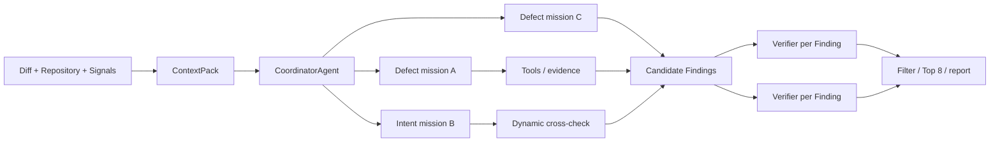

# ReviewCrew

ReviewCrew 是一个面向 Pull Request diff 的动态 Multi-Agent 代码审查系统。Coordinator 根据改动实时拆分任务，多个缺陷与意图专家实例并发取证；高风险结论会触发跨 Agent 交叉检查，每条候选 Finding 再由独立 Verifier 对抗验证。

项目实现以 [design-doc.md](design-doc.md)、[agent-topology.md](agent-topology.md)、[frontend-design.md](frontend-design.md) 和 [implementation-plan.md](implementation-plan.md) 为规格来源。

## 核心能力

- 聚焦 PR diff，结合修改文件、调用关系、仓库架构和历史修复模式组装上下文。
- 覆盖安全、逻辑、业务、内存、架构和静态质量问题。
- CoordinatorAgent 根据文件簇、静态信号和变更意图生成带依赖与优先级的任务图。
- 多个 DefectAgent 与 IntentAgent 任务实例按依赖并发执行，不使用固定 Pipeline。
- 高风险 Finding 动态触发另一专家视角的 handoff；Verifier 按 Finding 扇出反证。
- Semgrep、Ruff 和 OSV 等传统扫描信号可作为证据注入；工具缺失时优雅降级。
- JSONL 工作流事件记录任务、工具证据、handoff、Finding 与验证结果，支持 SSE、Replay 和问题归因。
- CLI、FastAPI 和 Vue 驾驶舱共用同一套 Pydantic 数据契约。
- 最终 Finding 置信度门限为 `0.6`，每个 PR 最多输出 8 条。

## 架构



离线知识层写入仓库自身的 `profile/` 目录：

- `symbols.db`：tree-sitter 抽取的符号、引用和调用图。
- `architecture.md`：模块、语言和仓库说明摘要。
- `bug_patterns.md`：从历史修复提交中归纳的缺陷模式。

在线层由纯 `asyncio` Orchestrator 编排，不把流程控制实现成 Agent，也不依赖 LangGraph 或 CrewAI。

## 技术栈

- 后端：Python 3.12、Pydantic 2、Pydantic AI、httpx、tree-sitter、SQLite、FastAPI。
- 前端：Vue 3、Vite、TypeScript strict、Pinia、Tailwind CSS、Naive UI、Vue Flow、ECharts。
- 测试：pytest、Ruff、Mypy strict、Vitest、ESLint、vue-tsc。
- 模型：OpenAI 兼容接口，默认 `deepseek-v4-pro`。

## 安装

本工作区要求使用 conda 的 `common` 环境：

```bash
/Users/xuansama/miniforge3/envs/common/bin/python -m pip install -e '.[dev]'
```

静态扫描器是可选依赖。未安装时相应 provider 返回空信号，不阻断 LLM 审查：

```bash
/Users/xuansama/miniforge3/envs/common/bin/python -m pip install -e '.[signals]'
```

安装前端：

```bash
cd web
npm install
```

## 模型配置

复制 `.env.example` 中的变量到你自己的 shell 或未纳入版本控制的 `.env`。API key 只能通过环境变量提供，不应写入源码、提交记录、Replay 或文档。

```bash
export LLM_API_KEY='your-api-key'
export LLM_BASE_URL='https://api.ai-native-x.site/v1'
export LLM_MODEL='deepseek-v4-pro'
export LLM_TEMPERATURE='0.2'
```

兼容旧变量名 `GLM_API_KEY`、`GLM_BASE_URL`、`GLM_MODEL` 和 `GLM_TEMPERATURE`。`LLM_*` 优先级更高。

可选运行参数：

```bash
export REVIEWCREW_MAX_AGENTS='4'
export REVIEWCREW_TIMEOUT='600'
```

验证模型连通性会产生一次真实 API 调用：

```bash
/Users/xuansama/miniforge3/envs/common/bin/python -m reviewcrew.llm.glm
```

## CLI 使用

先构建或刷新仓库 Profile：

```bash
/Users/xuansama/miniforge3/envs/common/bin/python -m reviewcrew.profile.builder \
  update --repo /absolute/path/to/repository
```

审查 GitHub PR：

```bash
/Users/xuansama/miniforge3/envs/common/bin/python -m reviewcrew.cli review \
  --pr https://github.com/owner/repository/pull/123 \
  --repo-path /absolute/path/to/repository
```

也可以审查本地 unified diff，从而避免 GitHub 网络依赖：

```bash
git -C /absolute/path/to/repository diff main...HEAD > /tmp/change.diff
/Users/xuansama/miniforge3/envs/common/bin/python -m reviewcrew.cli review \
  --pr /tmp/change.diff \
  --repo-path /absolute/path/to/repository
```

输出位于 `runs/<run_id>/`：

- `events.jsonl`：阶段、Agent、工具、Finding、Verdict 和报告事件。
- `change.diff`：本次审查的原始 diff。
- `report.md`：最终 Markdown 审查报告。
- `github_comments.json`：按文件和行号组织的 GitHub Review Comment 载荷。
- `error.json`：后台任务失败时的错误类型与信息。

## Web 驾驶舱

终端一启动 API：

```bash
/Users/xuansama/miniforge3/envs/common/bin/python -m uvicorn \
  reviewcrew.server.app:app --host 127.0.0.1 --port 8000
```

终端二启动前端：

```bash
cd web
npm run dev -- --host 127.0.0.1 --port 5173
```

打开 `http://127.0.0.1:5173/review`。没有模型 key 时也可以点击“演示 Replay”，从空图开始查看 Coordinator 拆解、并发任务、工具取证、跨 Agent handoff、Verifier 扇出与误报淘汰。

主要路由：

- `/review`：实时审查与内置 Replay。
- `/review/<run_id>?mode=replay&speed=4`：从后端 JSONL 加速回放。
- `/review/<run_id>/diff`：行级 Diff 和可复制的 PR comment。
- `/benchmark`：最新真实评测结果；结果缺失时明确标记为演示数据。

## API

| Method | Path | Purpose |
|---|---|---|
| GET | `/api/health` | 健康检查 |
| POST | `/api/review` | 启动后台审查，返回 `run_id` |
| GET | `/api/stream/<run_id>` | 实时 SSE 事件流 |
| GET | `/api/replay/<run_id>?speed=2` | 按原时间间隔回放事件 |
| GET | `/api/runs` | 运行列表 |
| GET | `/api/runs/<run_id>` | 事件、报告和 diff |
| GET | `/api/benchmark/latest` | 最新评测摘要与明细 |

请求示例：

```bash
curl -fsS http://127.0.0.1:8000/api/health
curl -fsS -X POST http://127.0.0.1:8000/api/review \
  -H 'Content-Type: application/json' \
  -d '{"pr_url":"/tmp/change.diff","repo_path":"/absolute/path/to/repository"}'
```

## Profile 维护

首次接入或索引损坏时做全量构建：

```bash
/Users/xuansama/miniforge3/envs/common/bin/python -m reviewcrew.profile.builder \
  update --repo /absolute/path/to/repository
```

PR 合并后对变更源文件做增量更新：

```bash
/Users/xuansama/miniforge3/envs/common/bin/python -m reviewcrew.profile.builder \
  update --repo /absolute/path/to/repository \
  --changed src/auth.py src/service.py
```

推荐维护周期：

- 每次主分支 merge：增量更新符号、引用和调用关系。
- 每日：刷新架构摘要，及时反映目录和模块变化。
- 每周：重新挖掘历史修复模式。
- 解析器版本或语言配置变化：执行一次全量重建。

`profile/` 是可再生成产物，默认不提交。生产环境应把它缓存到与仓库 commit SHA 绑定的制品存储，避免错误复用旧索引。

## Benchmark

`benchmark/dataset.yaml` 只接受组织有权使用的 Greptile benchmark manifest。仓库不会伪造 PR、漏洞行号、fork 链接或成绩。

仓库另附一个来自公开 PR discussion 的可复现小样例 `benchmark/public_sample.yaml`，只用于端到端冒烟验证，不计入正式 50-PR 指标。

导入前检查 schema：

```bash
/Users/xuansama/miniforge3/envs/common/bin/python -m benchmark.collect \
  --source /path/to/authorized-manifest
```

填入授权 manifest 后，可先用 fake runner 验证 harness 文件生成，不调用模型：

```bash
/Users/xuansama/miniforge3/envs/common/bin/python -m benchmark.run_eval \
  --quick --runner fake
```

公开单案例真实运行：

```bash
/Users/xuansama/miniforge3/envs/common/bin/python -m benchmark.run_eval \
  --quick --runner real --dataset benchmark/public_sample.yaml
```

真实评测会调用 ReviewCrew 和语义 judge，并产生模型费用：

```bash
/Users/xuansama/miniforge3/envs/common/bin/python -m benchmark.run_eval \
  --quick --runner real
/Users/xuansama/miniforge3/envs/common/bin/python -m benchmark.run_eval \
  --full --runner real
```

结果写入 `benchmark/results/<UTC timestamp>/results.jsonl` 和 `summary.md`。对 miss 做归因：

```bash
/Users/xuansama/miniforge3/envs/common/bin/python -m reviewcrew.tools.analyze_miss \
  --run-id <run_id> \
  --expected-bug 'expected failure mode and location'
```

评测方法、当前证据和未执行项见 [docs/评测报告.md](docs/评测报告.md)，迭代记录见 [benchmark/results/ITERATION_LOG.md](benchmark/results/ITERATION_LOG.md)。

## 开发与质量门禁

后端：

```bash
/Users/xuansama/miniforge3/envs/common/bin/python -m pytest
/Users/xuansama/miniforge3/envs/common/bin/python -m ruff check .
/Users/xuansama/miniforge3/envs/common/bin/python -m mypy reviewcrew benchmark tests
```

前端：

```bash
cd web
npm run typecheck
npm run lint
npm run test
npm run build
```

## 与传统规则扫描的边界

| 维度 | 传统规则扫描 | ReviewCrew |
|---|---|---|
| 已知模式 | 快、确定、成本低 | 将扫描结果作为证据再裁决 |
| 业务逻辑 | 通常缺少意图与跨文件上下文 | IntentAgent 比较意图、实现和测试 |
| 误报控制 | 依赖规则精度和人工筛选 | Verifier 主动寻找反证并重评分 |
| 仓库适配 | 通用规则集 | 架构摘要和历史 bug 模式 |
| 扫描范围 | 常见为全仓 | 以 PR diff 为中心按需扩展 |

ReviewCrew 不替代 SAST、依赖审计或人工审批。它把这些信号与仓库语义结合，用于提高复杂缺陷的发现率和报告可操作性。

## 安全说明

- 不要提交真实 API key；`.env`、`runs/`、`repos/`、`profile/` 和评测运行目录已忽略。
- Toolbox 会解析并限制仓库内路径，避免 Agent 读取仓库外文件。
- 对私有仓库运行前，确认所用模型服务的数据处理政策符合组织要求。
- `github_comments.json` 只是本地载荷；当前实现不会自动向 GitHub 发布评论。

## 已知外部依赖

完成正式 50-PR 指标、5 个 fork 链接、命中案例截图和 `demo.mp4` 需要授权数据集、GitHub 组织权限和人工录屏环境。这些不可由源码测试替代，当前状态在评测报告中明确列出。

## License

MIT
