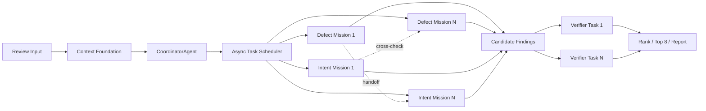

# ReviewCrew 动态 Multi-Agent 调度设计

## 背景

当前实现把审查过程表现为固定五阶段 Pipeline，中间 Vue Flow 图也固定为 Diff、两个专家和 Verifier 四个节点。事件只能改变节点颜色，不能解释为什么启动某个 Agent、它负责什么任务、如何取证、何时转交、为什么追加验证。因此界面更像顺序调用器，没有体现 Multi-Agent 的任务分解、并发协作和对抗验证优势。

本次改造将固定 Pipeline 替换为事件驱动的运行时任务图，并新增 CoordinatorAgent 负责审查任务规划。用户看到的图必须来自真实调度状态，不再由前端硬编码。

## 目标

- CoordinatorAgent 根据 diff、仓库 Profile 和静态信号动态生成审查任务。
- 调度器依据依赖、优先级、并发预算和剩余时间运行任务，而不是按固定阶段顺序调用 Agent。
- DefectAgent 与 IntentAgent 可针对不同文件簇启动多个任务实例，并发收集独立证据。
- Agent 可以请求交叉检查或把问题转交给另一个专家。
- Verifier 按候选 Finding 动态启动，对冲突结论和高风险结论优先验证。
- 前端从空状态开始，完整展示任务生成、派发、工具调用、Finding 流转与验证结果。
- 所有面向用户的任务目标、推理、Finding、验证理由和报告使用简体中文。
- 保留 600 秒硬超时、并发上限、0.6 置信度门限和最多 8 条 Finding。

## 非目标

- 不引入 LangGraph、CrewAI 等外部图编排框架。
- 不允许 Agent 直接控制文件系统、进程或网络；所有操作仍通过受限 Toolbox。
- 不把报告汇总、事件存储或资源预算包装成 Agent。
- 不为了动画伪造不存在的任务或工具调用。

## 总体架构



Context Foundation 仍由普通代码完成 diff 解析、Profile 和静态信号收集，但不再作为固定 UI 阶段展示。它只产生 Coordinator 所需的输入和运行事件。

## CoordinatorAgent

CoordinatorAgent 是第 4 种 Agent，只负责计划和调度建议，不直接生成最终 Finding。结构化输出为 `ReviewPlan`：

```python
class ReviewMission(BaseModel):
    id: str
    agent: Literal["defect", "intent"]
    objective: str
    rationale: str
    context_pack_ids: list[str]
    focus_files: list[str]
    priority: int
    depends_on: list[str]

class ReviewPlan(BaseModel):
    summary: str
    missions: list[ReviewMission]
```

规划规则：

- 每个任务必须有具体中文目标，不能只写“检查代码”。
- 安全、内存、静态信号优先交给 DefectAgent。
- 意图偏差、状态机、业务约束和架构依赖优先交给 IntentAgent。
- 同一高风险文件可以派发两个不同视角的任务，但目标必须不同。
- 无风险证据时也至少创建一个 Defect 和一个 Intent 任务，避免单视角遗漏。
- 任务数量受 ContextPack 数量、并发上限和剩余时间约束。

Coordinator 失败或返回无效计划时，调度器生成确定性降级计划：每个 ContextPack 各创建一个 Defect 与 Intent 任务，并记录 fallback 原因。

## 事件驱动调度器

调度器维护显式任务队列，任务状态为：

```text
queued -> running -> waiting | completed | failed | cancelled
```

任务类型包括：

- `coordinate`：Coordinator 生成计划。
- `review`：专家审查一个或多个 ContextPack。
- `cross_check`：另一个专家复核指定假设。
- `verify`：Verifier 质疑一个候选 Finding。
- `report`：普通代码汇总最终结果。

调度循环：

1. 将依赖已完成的 queued 任务按优先级入选。
2. 在 `REVIEWCREW_MAX_AGENTS` 范围内并发启动 Agent 任务。
3. 任务完成后收集 Finding、handoff 和 cross-check 请求。
4. 对有效请求创建新任务与新依赖边；重复请求按任务签名去重。
5. 对去重后的候选 Finding 创建独立 Verifier 任务，高严重度优先。
6. 无 ready/running 任务或预算不足时收敛。
7. 应用置信度门限、排序和 Top 8，生成报告。

为避免无界循环，每个 run 最多允许一次跨专家转交链、固定任务总数上限和 600 秒硬超时。超时任务保留最后一次 snapshot，并在图中显示 cancelled，而不是静默消失。

## 调度事件契约

新增 workflow 事件，不再用固定 stage 事件驱动主界面：

```python
class WorkflowNode(BaseModel):
    id: str
    kind: Literal["input", "coordinator", "agent_task", "tool", "finding", "verifier", "report"]
    label: str
    agent: Literal["coordinator", "defect", "intent", "verifier"] | None
    status: Literal["queued", "running", "waiting", "completed", "failed", "cancelled"]
    detail: str | None

class WorkflowEdge(BaseModel):
    id: str
    source: str
    target: str
    relation: Literal["dispatch", "depends_on", "tool_call", "evidence", "handoff", "candidate", "challenge", "result"]

class PipelineEvent(BaseModel):
    type: Literal["run", "workflow_node", "workflow_edge", "agent", "thought", "tool", "finding", "verdict", "report"]
    # 对应类型字段省略
```

旧 stage 事件只用于兼容已有 Replay，不再决定新界面结构。每个节点和边必须由后端真实调度动作产生，Replay 直接重放相同事件。

## 中文输出

- Coordinator、Defect、Intent、Verifier system prompt 明确要求简体中文。
- Finding 的 `title`、`reasoning`、`trigger_path` 和 `suggestion` 必须为中文；代码标识符、文件路径和引用片段保持原文。
- Verdict reason、任务目标、调度理由和 Markdown 报告统一为中文。
- 前端节点类型、队列状态、工具名称说明和空状态统一为中文。
- 后端 schema 不自动机器翻译，避免破坏技术含义；通过 prompt 和结构化校验保证输出语言。

## 前端信息架构

### 左侧：调度面板

删除固定 Pipeline 列表，改为：

- 剩余时间与 Agent 并发占用。
- queued、running、completed、failed 数量。
- 按时间排序的调度决策，例如“高风险文件触发双专家交叉检查”。
- 最近任务列表，显示 Agent、目标和状态。

### 中间：运行时工作流

画布初始只有 Review Input；Replay 从空画布开始。

- Coordinator 节点出现并进入 running。
- 计划返回后任务节点按依赖关系展开，不预先创建空节点。
- 同一 Agent 的多个任务使用实例编号与具体目标区分。
- 工具调用作为当前任务旁的临时卫星节点，并通过 evidence 边返回。
- Finding 节点从专家任务流向 Verifier；reject 后变灰并收缩，keep 后流向报告。
- 选择节点后在画布下方显示目标、理由、输入文件、工具次数、耗时和结果摘要。

### 右侧：Findings

保留现有卡片，但内容改成中文，并增加来源任务和验证路径。点击卡片同时选中工作流中的 Finding 节点，使图与结果互相解释。

## 动画设计

- 节点创建：140-220ms 的 opacity + translateY，按真实事件顺序进入。
- running：边上使用移动 dash 表示正在传递任务或证据，节点只做轻微边框脉冲。
- 工具调用：卫星节点从 Agent 节点展开，完成后降低强调但保留可回看记录。
- Finding：从来源任务沿 candidate 边进入；Verifier verdict 到达后播放 keep/reject 状态过渡。
- reject：降低 opacity、增加删除线，challenge 边变为错误色后停止动画。
- completed：边停止运动，节点显示耗时与数量，不发生布局跳动。
- 动画只修改 transform、opacity、stroke-dashoffset；尊重 `prefers-reduced-motion`。

颜色、间距、圆角和动画时长均通过现有设计 token 管理，不增加装饰性渐变、光球或卡片嵌套。

## 从零 Replay

内置 Replay 必须覆盖完整调度过程：

1. 输入节点出现。
2. Context Foundation 完成后 Coordinator 被派发。
3. Coordinator 生成至少三个目标不同的专家任务。
4. 两个专家并发运行并产生工具节点。
5. 一个专家发起 cross-check 或 handoff。
6. 产生至少两个候选 Finding。
7. Verifier 保留一个、拒绝一个。
8. 报告节点收敛并显示最终数量。

Replay 时间线不少于 6 秒，提供 1x、2x 和 4x 速度，确保用户能观察调度而不是瞬间跳完。

## 错误处理

- Coordinator 失败：记录 failed，展示中文 toast，执行 fallback 计划。
- 单个专家失败：任务节点标红，其它独立任务继续。
- Toolbox 失败：工具节点显示失败结果，由 Agent 决定继续或提交 snapshot。
- Verifier 失败：保留候选原置信度，但仍执行统一 0.6 门限，并在报告标注未验证。
- SSE 中断：保留当前图状态，提供 Replay/重新连接入口。
- 任务或边引用未知节点：前端忽略该边并记录开发错误，不让整个画布崩溃。

## Benchmark 小样本

使用 Greptile 公开 Benchmark 页面中的 Netflix Metaflow PR 3069：

- PR：`https://github.com/Netflix/metaflow/pull/3069`
- 文件：`metaflow/plugins/devcontainer/devcontainer_decorator.py`
- 目标位置：原始行 70，当前 discussion 行 84。
- 缺陷：将整个用户 home 目录以读写方式挂载到容器，暴露 SSH、云凭据等敏感文件，违背 sandbox 目标。
- 分类：security。

通过 GitHub API 获取 PR SHA 和公开 review comment，构造单条授权公开样本。只运行该 case，结果写入单独的小样本目录；不把它表述为 50-PR 正式成绩。

如果仓库克隆过大，先使用浅克隆或 PR head worktree；下载失败时使用用户提供的本地代理。真实模型调用只从 `LLM_API_KEY` 读取。

## 测试与验收

后端：

- Coordinator 结构化计划与 fallback。
- 依赖调度、优先级、并发上限、任务去重与动态 handoff。
- 每个调度动作产生对应 workflow node/edge 事件。
- Verifier 按 Finding 动态派发，门限和 Top 8 不回归。
- 中文 prompt 和中文报告契约。
- 旧 Replay 兼容。

前端：

- Pinia 从 workflow 事件归约出节点、边和任务计数。
- Replay 从空图逐步生成任务，不存在预置专家节点。
- Finding、Verdict、工具调用能更新对应节点与边。
- TypeScript strict、ESLint、Vitest 和生产构建通过。
- 桌面和 390px 移动端无重叠或水平溢出。
- 浏览器控制台无错误，Vue Flow 非空且节点数量随 Replay 增长。
- `prefers-reduced-motion` 下功能仍完整。

## 成功标准

- 静止截图能看出每个 Agent 实例的具体任务和依赖。
- Replay 过程中节点和边数量由事件增加，不再固定为四节点四边。
- 用户能回答“为什么启动这个 Agent、它查了什么、结果交给谁、Verifier 为什么保留或拒绝”。
- 左侧不再出现固定五阶段 Pipeline。
- Demo 与真实运行共用相同 workflow 事件和 store reducer。
- Greptile 单样本可以由 benchmark harness 执行并留下可复核结果。
